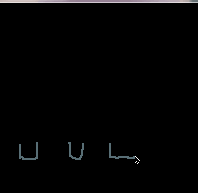
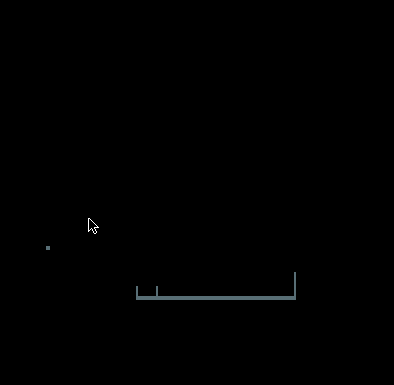
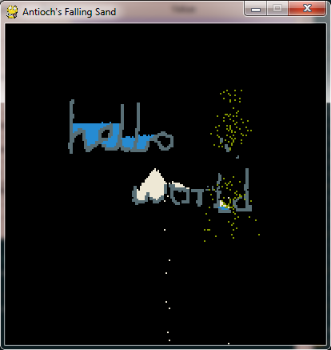

# Falling-Sand
A python imitation of the original Falling Sand game

This project is still in an ALPHA phase and is a *work in progress*

Implemented Features:
- 4 element types: Metal, Water, Sand + Acid, each with their own physics
- basic fluid simulation
- Mouse-drawing enabled
- Switch elements with the 1-4 keys
- Some basic element interactions (Sand becomes wet on contact with water, acid eats through metal)

Not-yet Implemented Features:
- More elements: Plant, Wood, Fire, TNT, gases?
- More unique interactions between elements (Eg: plants growing if given water, wood burning if it touches fire)
- visible user interface
- Liquids / gases mixing together

Known Bugs:
- Drawing is choppy and lines often have gaps in them
- Fluids don't mix

